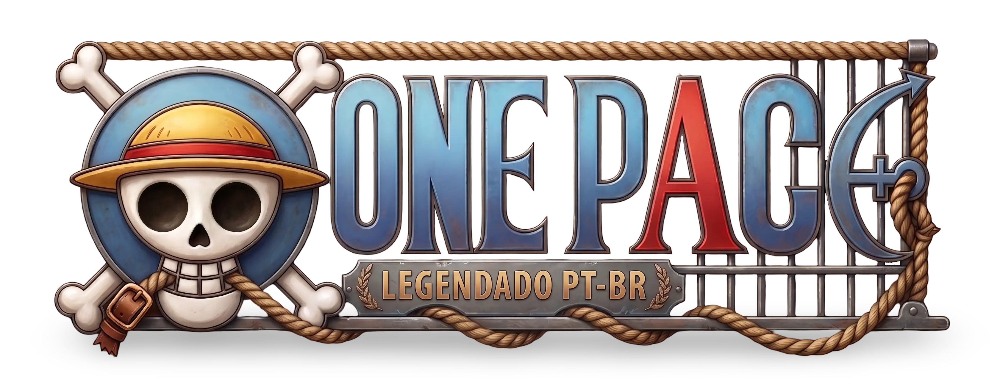

# One Pace BR Hub

Hub brasileiro dedicado a centralizar e organizar as sagas e arcos do projeto **One Pace**, com foco em apoiar a comunidade que acompanha o conteúdo com **legendas em PT-BR**.

---

## Sobre o projeto

O **One Pace BR Hub** nasceu da necessidade de ter um ponto de referência simples e acessível para navegar pelo conteúdo do One Pace de forma organizada, em português, com o objetivo de facilitar a descoberta do que assistir e em qual ordem.

A proposta é ser um “hub”: um lugar que ajuda a comunidade a encontrar e acompanhar as sagas/arcos, mantendo tudo bem estruturado e fácil de compartilhar.

## Objetivos

- **Centralizar** informações e organização de sagas/arcos do One Pace em um único lugar.
- **Apoiar a comunidade BR**, especialmente quem consome conteúdo com legendas PT-BR.
- **Facilitar o acesso e a navegação**, tornando mais rápido encontrar o arco/saga desejado.
- **Manter um projeto aberto e evolutivo**, que possa crescer com contribuições e melhorias ao longo do tempo.

## Status e contribuição

O projeto está em evolução contínua. Sugestões, correções e melhorias são bem-vindas.

- Abra uma **Issue** para reportar problemas ou sugerir mudanças.
- Envie um **Pull Request** se quiser contribuir diretamente.

## Aviso

Este projeto é **feito por fãs** e não possui afiliação oficial com *One Piece*, *Toei Animation*, *Shueisha* ou com a equipe original do **One Pace**.  
Todo crédito de personagens, histórias e materiais relacionados pertence aos seus respectivos detentores.

---
